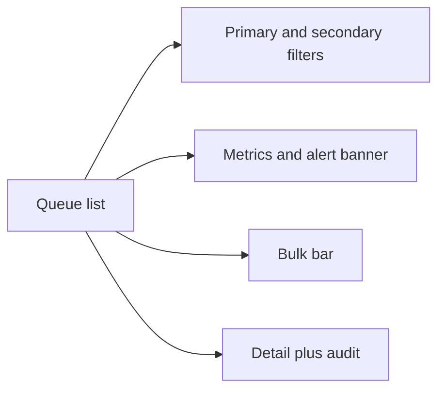
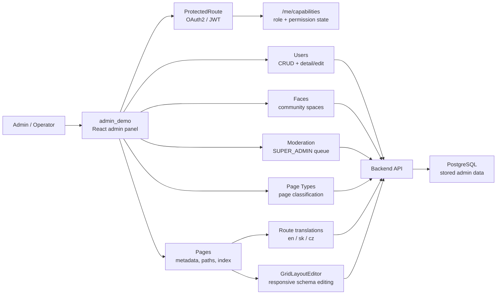
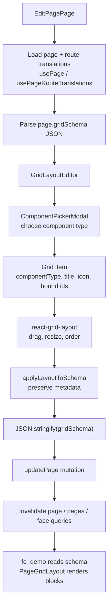

# Many Faces AI (MFAI) - admin panel application

## Overview

The MFAI admin panel is the operator-facing React application for configuring the Many Faces AI demo. It manages the structural data that shapes the user-facing experience: users, faces, page types, pages, localized routes, role-aware access, and the grid layout schemas rendered by the frontend.

The admin application is built around the same **faces** concept as the user frontend. A face can represent a public community, private group, branded space, or specialized social environment. Admin users configure those spaces by creating faces, assigning pages, editing page metadata, managing localized route translations, and arranging reusable social modules inside responsive page grids.

The most important bridge between the admin panel and frontend is the page `gridSchema`. Admin users edit the schema through `GridLayoutEditor`, choose component types through `ComponentPickerModal`, drag/resize blocks with `react-grid-layout`, and save the result through the Pages API. The frontend later reads the same schema and renders matching `PageGridLayout` / `ComponentBlock` structures for end users.

Security and trust boundaries are part of the admin design. The app uses OAuth2/JWT authentication, protected admin routes, capability warmup through `/me/capabilities`, role/permission helpers, and guarded views/actions so operational features are exposed intentionally. Backend enforcement remains the source of truth, while the admin UI mirrors those rules to keep sensitive administration workflows understandable.

From an engineering perspective, this submodule demonstrates a modern React admin architecture: generated OpenAPI clients, TanStack Query hooks, localized admin routes, reusable Radix-based form/table components, protected layouts, page editors, grid schema editing, Docker-based local development, linting, type checks, unit tests, and integration with the root monorepo scripts.

## What This Admin Panel Shows

- Admin CRUD workflows for users, faces, pages, and page types.
- Face/page configuration that directly drives the user-facing frontend.
- Localized admin routes and page route translation management.
- Responsive grid schema editing with draggable/resizable blocks.
- Component picking for albums, ads, blogs, chat rooms, profiles, reels, stories, and their grid/carousel variants.
- Preservation of component metadata such as title, icon, and bound content ids while layouts are edited.
- Superadmin-only **content moderation** for user-created albums, blogs, and reels: extended **filters**, **metrics** with **alerts**, **bulk** approve/reject/remove/requeue, per-item audit, and detail drawer — see [`docs/guides/ai-assisted-content-approval.md`](../docs/guides/ai-assisted-content-approval.md).
- OAuth2/JWT-backed protected admin routes.
- Capability-aware admin state loaded through `/me/capabilities`.
- Generated OpenAPI API client with typed services and models.
- TanStack Query hooks for resource loading, mutation, cache invalidation, and UI refresh.
- Docker-first local development that works both standalone and through the root monorepo scripts.
- Validation through ESLint, TypeScript checks, Vitest tests, and component/API hook tests.

## Content Moderation

The **Moderation** area reviews FE user-created albums, blogs, and reels. The UI targets **`SUPER_ADMIN`** only; the API enforces the same for queue reads, metrics, single actions, bulk, and audit fetches.

Typed hooks (`useContentModerationApi`) call `GET /api/contentmoderation`, `GET /api/contentmoderation/metrics` (unwraps `{ metrics, alerts }` for cards and banners), bulk `POST /api/contentmoderation/bulk`, and per-item approve/reject/remove/requeue. **Filters** cover content type, human and AI approval states, face, author, risk, flags substring, confidence band, submitted window, last reviewer, queue age, and moderation version. **Bulk** selection applies a shared reason where the backend requires it and shows per-row success/failure. Helpers in `src/utils/contentModeration.ts` normalize labels and reasons for display; Vitest covers the helpers.



## Admin Configuration Flow

Admin users configure the data model that the backend stores and the frontend later renders:



## Grid Schema Lifecycle

The admin panel creates and updates the `gridSchema` that the frontend consumes as a read-only layout:



## Features

- **Resource Management**
  - User management (create, read, update, delete)
  - Face management (create, read, update, delete)
  - Page management (create, read, update, delete)
  - Page Type management (create, read, update, delete)

- **Modern React Stack**
  - React 18 with TypeScript
  - Vite for fast development and building
  - React Router for navigation
  - React Query for API data management

- **User Authentication**
  - OAuth2 login flow
  - Protected admin routes
  - JWT token management

- **UI Components**
  - Custom Radix-based components (Button, Input, FormField, Table)
  - Bootstrap styling
  - Toast notifications
  - Responsive design with sidebar navigation

- **Internationalization (i18n)**
  - Multi-language support (English, Slovak, Czech)
  - Language switching in UI

- **API Integration**
  - Auto-generated API client from Swagger/OpenAPI
  - Type-safe API calls
  - Error handling and retry logic

## Technologies

- **React 18** - UI library
- **TypeScript** - Type-safe JavaScript
- **Vite** - Build tool and dev server
- **React Router** - Client-side routing
- **React Query (TanStack Query)** - Server state management
- **Bootstrap** - CSS framework
- **Yarn** - Package manager (PnP mode)
- **Vitest** - Unit testing framework

## Project Structure

```
admin_demo/
├── src/
│   ├── api/                # Auto-generated API client
│   │   ├── services/       # API service classes
│   │   ├── models/         # TypeScript models
│   │   └── core/           # API core utilities
│   ├── components/         # React components
│   │   ├── radix/          # Custom UI components (Button, Input, FormField, Table)
│   │   ├── __tests__/      # Component tests
│   │   └── ...             # Other components (UsersTable, FacesTable, PagesTable, Sidebar)
│   ├── pages/              # Page components
│   │   ├── UsersPage.tsx   # User list page
│   │   ├── CreateUserPage.tsx
│   │   ├── EditUserPage.tsx
│   │   ├── UserDetailPage.tsx
│   │   └── ...             # Similar pages for Faces and Pages
│   ├── contexts/           # React contexts (Auth, App)
│   ├── hooks/              # Custom React hooks
│   │   └── api/            # API hooks (useUsersApi, useFacesApi, usePagesApi)
│   ├── i18n/               # Internationalization
│   ├── styles/             # Global styles
│   ├── utils/              # Utility functions
│   └── main.tsx            # Application entry point
├── public/                 # Static assets
├── docker-compose.yml      # Docker Compose configuration
├── Dockerfile.dev          # Development Dockerfile
├── Dockerfile              # Production Dockerfile
├── start-dev.sh            # Start development script
├── stop-dev.sh             # Stop development script
├── clear-dev.sh            # Clear containers script
├── rebuild-dev.sh          # Rebuild Docker images script
└── README.md               # This file
```

## Running

### Running in Docker Container (Recommended)

The easiest way to run the admin panel in development:

```bash
./start-dev.sh
```

This script will:

1. Check and install dependencies if needed
2. Run code validation (TypeScript, ESLint)
3. Format code with Prettier
4. Run unit tests
5. Start the Vite dev server in Docker
6. Make the app available at `http://localhost:8082`

**Note**: The script runs tests before starting. If tests fail, the startup is stopped.

### Manual Docker Compose

```bash
docker-compose -f docker-compose.yml up --build
```

### Using Root Docker Compose

```bash
# From root directory
docker-compose -f docker-compose.dev.yml up -d admin-demo-dev
```

### Stopping Services

```bash
./stop-dev.sh
```

Or manually:

```bash
docker-compose -f docker-compose.yml down
```

### Clearing Everything

```bash
./clear-dev.sh
```

This removes containers, volumes, and images.

### Rebuilding Docker Images

To perform a clean rebuild of Docker images:

```bash
./rebuild-dev.sh
```

**Note**: This only builds images, it does NOT start containers. Use `./start-dev.sh` to start containers after rebuilding.

### Local Development (Without Docker)

1. **Install dependencies**:

   ```bash
   yarn install
   ```

2. **Start development server**:

   ```bash
   yarn dev
   ```

   The app will be available at `http://localhost:8082`

3. **Run tests**:

   ```bash
   yarn test
   ```

4. **Format code**:

   ```bash
   yarn format
   ```

5. **Build for production**:
   ```bash
   yarn build
   ```

## Configuration

### Environment Variables

The admin panel uses environment variables (configured in `docker-compose.yml` or `.env`):

- `VITE_API_URL` - Backend API URL (default: `http://localhost:8000`)
- `VITE_API_HTTPS_URL` - Backend API HTTPS URL (default: `https://localhost:8001`)
- `VITE_APP_NAME` - Application name (default: `Admin Demo`)
- `VITE_APP_VERSION` - Application version
- `VITE_PORT` - Dev server port (default: `8081`)
- `VITE_DEV_PORT` - Development port mapping (default: `8082`)

### API Configuration

The API client is auto-generated from the backend Swagger/OpenAPI specification. To regenerate:

```bash
yarn generate:api
```

This updates the API client in `src/api/` based on the backend API schema.

## Pages

- **Home** (`/`) - Dashboard/landing page
- **Login** (`/login`) - Admin login page (OAuth2)
- **Users** (`/users`) - User list and management
  - `Create User` - Create new user form
  - `Edit User` - Edit existing user form
  - `User Detail` - View user details
- **Faces** (`/faces`) - Face list and management
  - Similar CRUD pages as Users
- **Pages** (`/pages`) - Page list and management
  - Similar CRUD pages as Users

All pages support internationalization with localized routes.

## Components

### Custom Components

- **Button** - Styled button component
- **Input** - Text input component
- **FormField** - Form field with label and validation
- **Table** - Data table component with sorting and pagination
- **UsersTable** - User-specific table with actions
- **FacesTable** - Face-specific table with actions
- **PagesTable** - Page-specific table with actions
- **Sidebar** - Navigation sidebar
- **Header** - Application header with navigation
- **LanguageSwitcher** - Language selection dropdown
- **ProtectedRoute** - Route guard for authenticated users
- **GuestRoute** - Route guard for unauthenticated users

### API Integration

API client is generated from Swagger and provides type-safe methods:

```typescript
import { UsersService, FacesService, PagesService } from '@/api';

// Get all users
const users = await UsersService.getUsers();

// Create user
const newUser = await UsersService.createUser({
	email: 'user@example.com',
	password: 'password123',
	firstName: 'John',
	lastName: 'Doe',
});

// Update user
await UsersService.updateUser(userId, {
	firstName: 'Jane',
});

// Delete user
await UsersService.deleteUser(userId);
```

### Custom Hooks

The admin panel provides custom hooks for API operations:

- `useUsersApi()` - User management hooks
- `useFacesApi()` - Face management hooks
- `usePagesApi()` - Page management hooks
- `useAuthApi()` - Authentication hooks

## Development Workflow

1. **Start backend**: Ensure backend API is running (via `be_demo` or monorepo `./scripts/start-all-dev.sh`)

2. **Start admin panel**: Run `./start-dev.sh` or use monorepo `./scripts/start-all-dev.sh` to start all services

3. **Make code changes**: Edit code in `src/`

4. **Test changes**:
   - Unit tests: `yarn test`
   - Component tests: `yarn test` (tests in `src/components/__tests__/` and `src/hooks/api/__tests__/`)
   - Manual testing: Open `http://localhost:8082`

5. **View logs**: Check Docker logs or browser console

6. **Stop services**: Run `./stop-dev.sh` or monorepo `./scripts/stop-all-dev.sh`

## Testing

### Run Tests

```bash
yarn test
```

### Run Tests in Watch Mode

```bash
yarn test:watch
```

### Run Tests with Coverage

```bash
yarn test:coverage
```

Tests are located in:

- `src/components/__tests__/` - Component tests (UsersTable, PagesTable)
- `src/hooks/api/__tests__/` - API hook tests (useFacesApi, usePagesApi, useUsersApi)
- `src/utils/__tests__/` - Utility function tests

## Code Quality

### Linting

```bash
yarn lint
```

### Formatting

```bash
yarn format
```

### Type Checking

```bash
yarn type-check
```

### eslint-plugin-react-hooks (ESLint 10 peers)

Stable `eslint-plugin-react-hooks@latest` did not yet list ESLint **10** in `peerDependencies`, which caused Yarn **`YN0060`** / **`YN0086`** with ESLint 10 in this workspace. The project therefore pins an **exact** canary version whose peers include **`^10.0.0`** (see [facebook/react#35758](https://github.com/facebook/react/issues/35758)). **Removal trigger:** when `npm view eslint-plugin-react-hooks@latest peerDependencies` includes `^10.0.0` for `eslint`, switch `package.json` to that stable release and re-run `yarn install --immutable` plus `yarn validate` / `yarn test` / `yarn build`. **Automation:** bumps are **manual** here (no Dependabot ignore list ships in-repo). Full notes: [docs/eslint-plugin-react-hooks-peer.md](./docs/eslint-plugin-react-hooks-peer.md).

## Build

### Development Build

```bash
yarn build
```

### Production Build

```bash
yarn build
```

Output will be in `dist/` directory, ready for deployment.

## Integration with Root Project

This admin panel is part of the `_mfai_demo` monorepo and integrates with:

- **Backend API**: `be_demo` (ASP.NET Core)
- **Database**: `db_demo` (PostgreSQL) - via backend
- **Redis**: `redis_demo` - job queue via backend
- **Frontend**: `fe_demo` (separate user-facing application)

Use root-level scripts to manage all services:

- `./scripts/start-all-dev.sh` - Start all services with live status screen
- `./scripts/stop-all-dev.sh` - Stop all services
- `./scripts/clear-all-dev.sh` - Clear all containers and volumes
- `./scripts/status-all.sh` - Show status of all services
- `./scripts/rebuild-all-dev.sh` - Rebuild all Docker images

## Troubleshooting

### Dependencies Not Installing

If Yarn PnP (Plug'n'Play) is causing issues:

```bash
# Check Yarn version
yarn --version

# Clear cache
yarn cache clean

# Reinstall
rm -rf .yarn/cache
yarn install
```

See `YARN_PNP.md` for more information.

### Port Already Allocated

If port 8082 is already in use:

```bash
# Find process using port
lsof -ti:8082

# Kill process
lsof -ti:8082 | xargs kill -9

# Or use clear script
./clear-dev.sh
```

### API Connection Failed

- Ensure backend API is running: `docker ps | grep be-demo-dev`
- Check API URL in environment variables
- Verify CORS is enabled on backend
- Check browser console for errors

### TypeScript Errors

- Ensure all dependencies are installed: `yarn install`
- Check TypeScript version: `yarn tsc --version`
- Try regenerating types: `yarn generate:api`

## Additional Documentation

- **Docker**: See `DOCKER.md` for Docker-specific documentation
- **Editor Setup**: See `SETUP_EDITOR.md` for IDE configuration
- **Yarn PnP**: See `YARN_PNP.md` for Yarn Plug'n'Play information
- **API Client**: See `src/api/README.md` for API client documentation
- **i18n**: See `src/i18n/README.md` for internationalization setup
