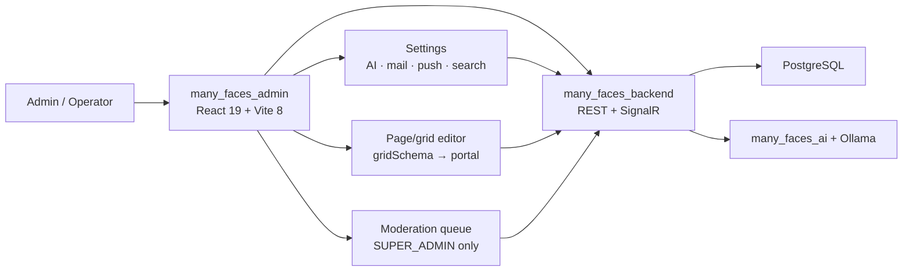
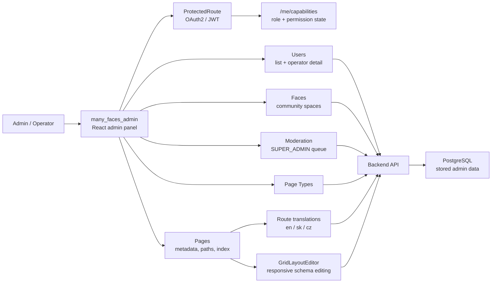
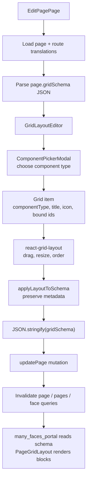
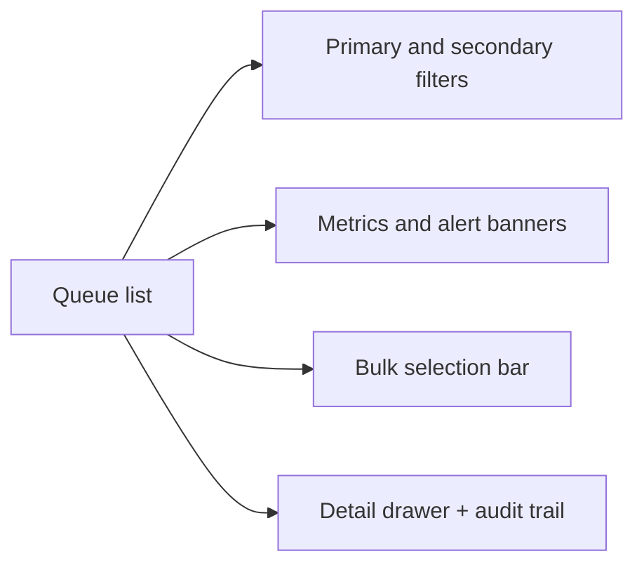
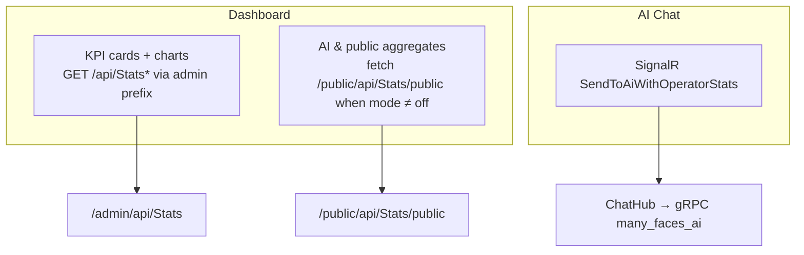

# Many Faces Admin

<!-- readme-badges:start -->

[](./VERSION)


[](https://github.com/01laky/many_faces_main/actions/workflows/ci.yml)


<!-- readme-badges:end -->

**Version:** [`1.3.1`](./VERSION) · [Changelog](./CHANGELOG.md)

**Author:** Ladislav Kostolny · [01laky@gmail.com](mailto:01laky@gmail.com)

> **Operator cockpit for Many Faces AI.** Where **platform super-admins** manage faces, pages, users, content moderation, operator AI chat, dashboard metrics, and infrastructure settings that shape the user-facing portal.

**Access:** `SUPER_ADMIN` only — global `ADMIN` must use `many_faces_portal`. Guide: [`../docs/guides/admin-superadmin-only-access.md`](../docs/guides/admin-superadmin-only-access.md)

---

## Quick Start

```bash
# Full stack — recommended
cd many_faces_main
./scripts/start-all-dev.sh

# Admin standalone
cd many_faces_admin
./scripts/start-dev.sh
```

**Access:** `https://localhost:8082` · API at `https://localhost:8001`  
**Demo accounts:** [`../docs/guides/local-dev-accounts.md`](../docs/guides/local-dev-accounts.md)

---

## Architecture



### Admin configuration flow



### Grid schema lifecycle

The admin panel creates and updates the `gridSchema` that the portal renders as a read-only layout:



---

## Three Pillars

| Pillar              | Highlights                                                                                                                                                                                                                                                                                 |
| ------------------- | ------------------------------------------------------------------------------------------------------------------------------------------------------------------------------------------------------------------------------------------------------------------------------------------ |
| **Security (ASH1)** | Super-admin gate: JWT role **and** `platform:super` capability (fail closed). HTTPS-only production API; SignalR JWT via `accessTokenFactory`; sanitized moderation previews. CI: `node ../scripts/verify-admin-security-tests.mjs`. Full guide: [`docs/SECURITY.md`](./docs/SECURITY.md). |
| **AI**              | **Operator AI chat** (SignalR, threaded conversations, RAG over platform stats); **stats modes** off/inline/live; **live map-reduce** parallel cap + Redis TTL in Settings → AI.                                                                                                           |
| **Configuration**   | **Grid layout editor** (`gridSchema` → portal/mobile); **Settings → Infrastructure** — mail SMTP config, push/search smoke tests, AI options; faces, pages, roles, route translations.                                                                                                     |

---

## What This Admin Panel Delivers

| Feature                       | Details                                                                                                      |
| ----------------------------- | ------------------------------------------------------------------------------------------------------------ |
| **Faces & Pages**             | Full CRUD + grid layout editor with drag-and-drop blocks; drives portal/mobile layout                        |
| **Users & Roles**             | Operator user detail, global/face bans (required reason), face `userRoleId` patch, platform DM               |
| **Content moderation**        | Filterable queue, metrics + alert banners, bulk approve/reject/remove/requeue, per-item audit, detail drawer |
| **Operator AI chat**          | Threaded SignalR conversations over platform stats (RAG); message history, streaming tokens                  |
| **Dashboard**                 | Platform KPIs + histograms (`GET /api/Stats`, `/timeseries`), AI & public aggregates panel                   |
| **Global search**             | Header autocomplete (`GET /admin/api/search/autocomplete`) with scroll load-more                             |
| **Super-admin DMs**           | Two-pane real-time messaging with end users via `MessengerHub`                                               |
| **Album/Reel consoles**       | Operator management (media grid, moderation actions, hard-delete, platform DM)                               |
| **Face wall tickets**         | Per-face idea backlog — list filters, create, staff comments, approve/deny/delete                            |
| **Admin profile**             | Self-service identity, password, face roles, avatar, email confirmation                                      |
| **Settings → Infrastructure** | Mail SMTP/From in DB; push FCM; search smoke tests — all configurable without redeploy                       |

---

## Security (ASH1)

- Super-admin gate: JWT role **and** `platform:super` capability (fail closed).
- Tokens in `localStorage`; logout clears auth + domain React Query caches.
- API traffic namespaced under `/admin/api/...`; OAuth and i18n bundle paths exempt.
- HTTPS required for production API URL; mixed content blocked at startup.
- SignalR JWT via `accessTokenFactory`, not URL query strings.
- Moderation previews and grid schema fields sanitized client-side (defense in depth).
- CI gate: `node scripts/verify-admin-security-tests.mjs`

Full guide: [`docs/SECURITY.md`](./docs/SECURITY.md)

---

## Content Moderation

The **Moderation** area reviews FE user-created albums, blogs, and reels. `SUPER_ADMIN` only — the API enforces the same gate for queue reads, metrics, single actions, bulk, and audit fetches.



Typed hooks (`useContentModerationApi`) call `GET /api/contentmoderation`, `GET /api/contentmoderation/metrics`, bulk `POST /api/contentmoderation/bulk`, and per-item approve/reject/remove/requeue.

**Filters:** content type, human/AI approval states, face, author, risk, flags, confidence band, submitted window, last reviewer, queue age, moderation version.

**Guide:** [`../docs/guides/ai-assisted-content-approval.md`](../docs/guides/ai-assisted-content-approval.md)

---

## Dashboard Metrics

The **Dashboard** loads consolidated platform statistics from `GET /api/Stats` and optional histograms from `GET /api/Stats/timeseries` under the **configured admin face prefix** (so the backend grants `CanManageAllFaces`).

The **AI & public aggregates** panel uses a **separate** URL shape for the anonymous snapshot: `absolutePublicFaceUrl('/api/Stats/public')` → `/public/api/Stats/public` — so it never accidentally calls `/admin/...` without a JWT.



**Guide:** [`../docs/guides/admin-dashboard-metrics.md`](../docs/guides/admin-dashboard-metrics.md)

---

## Tech Stack

| Layer           | Technology                | Version |
| --------------- | ------------------------- | ------- |
| UI framework    | React                     | 19      |
| Build tool      | Vite                      | 8       |
| Language        | TypeScript                | strict  |
| Routing         | React Router              | v6      |
| Data fetching   | TanStack Query            | v5      |
| Styling         | Bootstrap                 | 5       |
| Package manager | Yarn                      | PnP     |
| Unit tests      | Vitest                    | —       |
| API client      | Auto-generated (OpenAPI)  | —       |
| i18n            | i18next + backend `.resx` | —       |

---

## Project Structure

```
many_faces_admin/
├── src/
│   ├── api/                # Auto-generated OpenAPI client
│   ├── components/         # React components (colocated folders)
│   │   ├── radix/          # Button, Input, FormField, Table
│   │   ├── dashboard/      # DashboardCharts, metrics, moderation widget
│   │   ├── page-editor/    # GridLayoutEditor, ComponentPickerModal, GradientPicker
│   │   └── tables/         # UsersTable, FacesTable, PagesTable
│   ├── pages/              # Page components (one folder per page)
│   ├── contexts/           # Auth, App
│   ├── hooks/
│   │   └── api/            # useUsersApi, useFacesApi, usePagesApi, useContentModerationApi
│   ├── i18n/               # i18n config and namespace loaders
│   ├── utils/              # contentModeration.ts, adminSearchDetailPath.ts, …
│   └── main.tsx            # Entry point
├── docs/                   # SECURITY.md, performance appendix
├── scripts/                # start/stop/clear/rebuild-dev.sh, lint, fix-editor
├── docker-compose.yml      # Standalone dev compose
├── Dockerfile.dev          # Dev image
└── Dockerfile              # Production image
```

---

## Getting Started

### Prerequisites

- **Node 22+** · **Yarn 4** (Corepack) · **Docker + Compose v2**

### Running in Docker (Recommended)

```bash
./scripts/start-dev.sh
```

Checks and installs dependencies, runs TypeScript + ESLint, formats code, runs unit tests, and starts the Vite dev server.

**Ports:** Container Vite `8082` · Standalone `https://localhost:8082`

> **Note:** Tests run before start. If tests fail, startup stops.

### Without Docker

```bash
yarn install    # install deps (Yarn PnP)
yarn dev        # dev server on :8082
yarn test       # run all tests
yarn build      # production build → dist/
```

### Stop / Clear

```bash
./scripts/stop-dev.sh     # stop containers
./scripts/clear-dev.sh    # stop + remove containers, volumes, images
./scripts/rebuild-dev.sh  # rebuild image without starting
```

---

## Configuration

### Environment Variables

| Variable             | Default                  | Purpose                  |
| -------------------- | ------------------------ | ------------------------ |
| `VITE_API_URL`       | `http://localhost:8000`  | Backend HTTP URL         |
| `VITE_API_HTTPS_URL` | `https://localhost:8001` | Backend HTTPS URL        |
| `VITE_APP_NAME`      | `Many Faces Admin`       | Application name         |
| `VITE_APP_VERSION`   | —                        | Application version      |
| `VITE_PORT`          | `8081`                   | Vite dev server port     |
| `VITE_DEV_PORT`      | `8082`                   | Development port mapping |

### Regenerate API Client

```bash
yarn generate:api
```

Updates `src/api/` from the backend Swagger spec.

---

## Testing

```bash
yarn test               # all tests
yarn test:security      # ASH1 security subset (*.security.test.ts)
yarn test:watch         # watch mode
yarn test:coverage      # coverage report
```

From the monorepo root:

```bash
node scripts/verify-admin-security-tests.mjs
node scripts/verify-admin-global-search-tests.mjs
node scripts/verify-admin-me-profile-tests.mjs
node scripts/verify-admin-mail-settings-tests.mjs
```

---

## Code Quality

```bash
yarn lint         # ESLint
yarn format       # Prettier
yarn type-check   # TypeScript strict
yarn validate     # lint + type-check + format:check
```

---

## Troubleshooting

| Problem               | Solution                                                     |
| --------------------- | ------------------------------------------------------------ |
| Port 8082 in use      | `lsof -ti:8082 \| xargs kill -9` or `./scripts/clear-dev.sh` |
| Yarn PnP issues       | `rm -rf .yarn/cache && yarn install`                         |
| API connection failed | Check `docker ps \| grep be-demo-dev`; verify `VITE_API_URL` |
| TypeScript errors     | `yarn install && yarn generate:api`                          |

---

## Documentation

| Topic                    | Link                                                                                                                         |
| ------------------------ | ---------------------------------------------------------------------------------------------------------------------------- |
| **Security (ASH1)**      | [`docs/SECURITY.md`](./docs/SECURITY.md)                                                                                     |
| **Performance**          | [`docs/performance-and-query-appendix.md`](./docs/performance-and-query-appendix.md)                                         |
| **Access policy**        | [`../docs/guides/admin-superadmin-only-access.md`](../docs/guides/admin-superadmin-only-access.md)                           |
| **Dashboard + AI stats** | [`../docs/guides/admin-dashboard-metrics.md`](../docs/guides/admin-dashboard-metrics.md)                                     |
| **Operator AI chat**     | [`../docs/guides/admin-operator-ai-chat-threads.md`](../docs/guides/admin-operator-ai-chat-threads.md)                       |
| **Content moderation**   | [`../docs/guides/ai-assisted-content-approval.md`](../docs/guides/ai-assisted-content-approval.md)                           |
| **User detail + bans**   | [`../docs/guides/admin-operator-user-detail.md`](../docs/guides/admin-operator-user-detail.md)                               |
| **Admin profile**        | [`../docs/guides/admin-superadmin-profile.md`](../docs/guides/admin-superadmin-profile.md)                                   |
| **User chat**            | [`../docs/guides/admin-superadmin-user-chat.md`](../docs/guides/admin-superadmin-user-chat.md)                               |
| **Album detail console** | [`../docs/guides/admin-album-detail-moderation.md`](../docs/guides/admin-album-detail-moderation.md)                         |
| **Reel detail console**  | [`../docs/guides/admin-reel-detail-moderation.md`](../docs/guides/admin-reel-detail-moderation.md)                           |
| **Wall tickets**         | [`../docs/guides/admin-face-wall-tickets.md`](../docs/guides/admin-face-wall-tickets.md)                                     |
| **Global search**        | [`../docs/guides/admin-global-search-autocomplete.md`](../docs/guides/admin-global-search-autocomplete.md)                   |
| **Mailer config**        | [`../docs/guides/admin-mailer-configuration.md`](../docs/guides/admin-mailer-configuration.md)                               |
| **Push config**          | [`../docs/guides/admin-push-configuration.md`](../docs/guides/admin-push-configuration.md)                                   |
| **Infra smoke tests**    | [`../docs/guides/admin-settings-infrastructure-smoke-tests.md`](../docs/guides/admin-settings-infrastructure-smoke-tests.md) |
| **Local HTTPS**          | [`../docs/guides/dev-https.md`](../docs/guides/dev-https.md)                                                                 |
| **Monorepo docs hub**    | [`../docs/README.md`](../docs/README.md)                                                                                     |
| **i18n**                 | [`../docs/guides/static-localization-and-i18n.md`](../docs/guides/static-localization-and-i18n.md)                           |
| **UI design guide**      | [`../docs/guides/admin-ui-list-and-detail-pages.md`](../docs/guides/admin-ui-list-and-detail-pages.md)                       |

---

## Monorepo Integration

This admin panel is the `many_faces_admin/` submodule of [`many_faces_main`](https://github.com/01laky/many_faces_main). It integrates with:

| Service                 | Role                                                               |
| ----------------------- | ------------------------------------------------------------------ |
| **many_faces_backend**  | REST API, OAuth2, JWT, face config, grid schemas, AI orchestration |
| **many_faces_portal**   | Renders the `gridSchema` this admin edits                          |
| **many_faces_database** | PostgreSQL (via backend)                                           |
| **many_faces_redis**    | Job queue + AI live-stats cache (via backend)                      |

Monorepo orchestration scripts (run from `many_faces_main/`):

```bash
./scripts/start-all-dev.sh    # Start all services
./scripts/stop-all-dev.sh     # Stop all services
./scripts/clear-all-dev.sh    # Remove all containers and volumes
./scripts/status-all.sh       # Service status
./scripts/rebuild-all-dev.sh  # Rebuild all images
```

---

## Agent / AI Layout Guide

For **list tables** and **detail pages**, follow **[`../docs/guides/admin-ui-list-and-detail-pages.md`](../docs/guides/admin-ui-list-and-detail-pages.md)** (Cursor: `.cursor/rules/admin-ui-list-detail-pages.mdc`, entry: [`AGENTS.md`](./AGENTS.md)).

---

## Project Status

Active component of the **Many Faces AI** reference monorepo. v1.2.0 ships content moderation, face wall tickets, operator AI chat (RAG), admin profile, global search, album/reel consoles, and super-admin DMs. Tracked in [`CHANGELOG.md`](./CHANGELOG.md).
