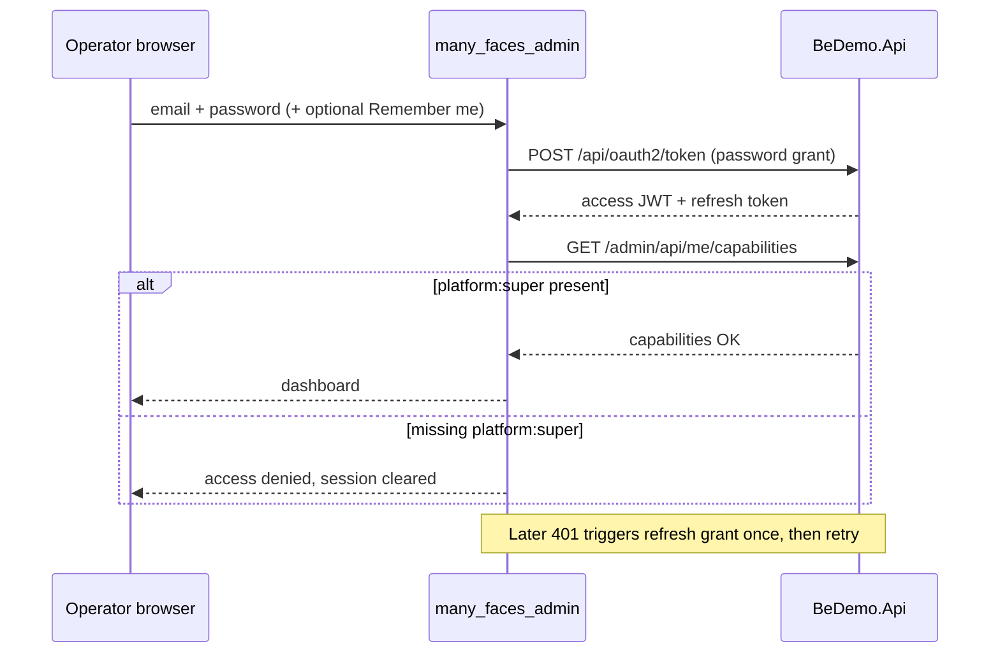

# Admin security guide

Plain-language security reference for operators and developers deploying **many_faces_admin**.

## 1. Who may use this app

This console is for **platform super-administrators** only (`SUPER_ADMIN` global role **and** `platform:super` capability).

- Customer **`ADMIN`** accounts must use **`many_faces_portal`**, not this app.
- See the monorepo guide: [`admin-superadmin-only-access.md`](../../docs/guides/admin-superadmin-only-access.md).

## 2. How sign-in works

Sign-in uses **OAuth2 password grant** against `POST /api/oauth2/token`, then **refresh token** rotation when the access JWT expires.

**Remember me:** when checked, the login request sends `rememberMe: true` so the backend issues a longer-lived JWT (`Jwt:ExpiresInMinutesRememberMe`). Unchecked uses the short session TTL.

## 3. Where tokens live

| Key | Purpose |
| --- | --- |
| `auth_token` | Access JWT |
| `auth_refresh_token` | Refresh token |
| `auth_user` | Cached display name/email (non-secret) |

Tokens are stored in **`localStorage`**. Any XSS on this origin could read them — the app avoids `dangerouslySetInnerHTML`, sanitizes operator-edited URLs/text, and redacts secrets in frontend logs.

**Shared computers:** always log out; do not use Remember me on untrusted machines.

**Multi-tab:** logging out or clearing storage in one tab signs out other open admin tabs (storage sync listener).

## 4. What happens on 403 / session expiry

| Event | Behavior |
| --- | --- |
| **403** on `/admin/api/...` | Session invalid for admin SPA → storage cleared → redirect to login |
| **403** on `/api/oauth2/token` | Login/refresh rejected (bad credentials/client) — **no** forced platform logout |
| **401** + failed refresh | Logout, redirect to login |
| **429** on token endpoint | “Try again” message — refresh token **not** deleted |
| JWT `exp` passed | Periodic check clears session; toast “session expired” |

## 5. Environment variables

| Variable | Required in prod | Dev example | Notes |
| --- | --- | --- | --- |
| `VITE_API_URL` | Yes | `https://localhost:8001` | Must be **HTTPS** in production builds |
| `VITE_DEFAULT_FACE_PREFIX` | Yes | `admin` | Routes REST to `/admin/api/...` |
| `VITE_OAUTH2_CLIENT_ID` | Yes | `be-demo-client` | Public client id |
| `VITE_OAUTH2_CLIENT_SECRET` | Yes | demo secret | **Demo value only** — production builds **fail** if placeholder secret remains |
| `VITE_SEQ_URL` | If logging on | `http://localhost:5342` | Seq ingestion endpoint |
| `VITE_ENABLE_SEQ_LOGGING` | No | `true` | Disable in prod if Seq unavailable |

Never commit real production secrets to git. Use deployment env injection (CI secrets, host env files).

## 6. HTTPS and API URL

- Production admin must be served over **HTTPS**.
- `VITE_API_URL` must use **`https://`** in production — mixed content (HTTPS page calling `http://` API) is blocked at startup.
- API URL must match backend **CORS** allowed origins.

## 7. SignalR / real-time

| Hub | Scoped URL | When it connects |
| --- | --- | --- |
| AI chat | `/admin/hubs/chat` | Super-admin signed in + AI globally enabled |
| Messenger | `/admin/hubs/messenger` | Super-admin signed in |

JWT is sent via SignalR **`accessTokenFactory`** (Authorization header on negotiate), **not** in the browser address bar. Hub URLs must not include `access_token` query parameters — frontend logs redact that pattern if it appears in diagnostics.

## 8. API path conventions

| Traffic | Path pattern |
| --- | --- |
| OAuth token | `/api/oauth2/token` (no face prefix) |
| Pre-login i18n bundle | `GET {apiUrl}/api/localization/admin` (no `/admin/` segment) |
| Authenticated REST | `/admin/api/...` (axios face-prefix interceptor) |
| SignalR | `/admin/hubs/...` |

**OpenAPI codegen:** never hand-edit `src/api/**`. Regenerate with `yarn generate:api` after swagger changes; security wiring stays in `config.ts`, `interceptors.ts`, and `faceApiRouting.ts`.

## 9. Moderation and untrusted content

- Moderation previews render **plain text** only (HTML escaped / not injected).
- Media preview URLs must be **`https://`** on allowed hosts.
- Page grid schema titles and bound URLs are sanitized before save.

## 10. Production checklist

- [ ] HTTPS for admin static host and API (`VITE_API_URL`)
- [ ] Replace demo OAuth client secret
- [ ] Configure nginx/CSP headers for static admin host (see monorepo deploy docs)
- [ ] Enable backend audit logging (BSH3)
- [ ] Run `yarn npm audit` and patch critical CVEs
- [ ] Run `node scripts/verify-admin-security-tests.mjs` in CI

## 11. Known limitations

| Topic | Status |
| --- | --- |
| **`TRACK-ASH1-BFF`** HttpOnly cookie session | **Deferred** — tokens remain in `localStorage`; BFF/cookie track is future work |
| Client secret in bundle | Vite embeds `VITE_OAUTH2_CLIENT_SECRET` — acceptable for demo; use confidential client + BFF for strict prod |
| AI chat cache on logout | Operator AI React Query cache may persist until hard refresh (documented waiver FE-A3) |

## 12. Reporting issues

File security bugs in the monorepo issue tracker with label **security**, including reproduction steps and affected route/API. Do **not** paste live JWTs, refresh tokens, or end-user PII into tickets.

---

**Related:** [`../../docs/guides/security-crypto-sockets.md`](../../docs/guides/security-crypto-sockets.md) (FE/admin row) · [`../../docs/guides/testing-and-ci-matrix.md`](../../docs/guides/testing-and-ci-matrix.md) (ASH1 CI gate)
