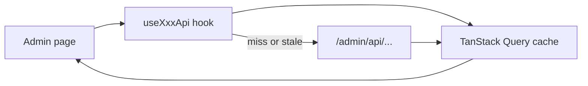

# Admin — TanStack Query & table performance appendix

**Scope:** `many_faces_admin` only. Canonical monorepo guides: [`docs/guides/admin-ui-list-and-detail-pages.md`](../../docs/guides/admin-ui-list-and-detail-pages.md), [`docs/guides/acl-and-capabilities.md`](../../docs/guides/acl-and-capabilities.md), [`docs/guides/admin-superadmin-only-access.md`](../../docs/guides/admin-superadmin-only-access.md).

## Global Query defaults

Defined in `src/providers/QueryProvider/QueryProvider.tsx`:

| Option                        | Value      | Rationale                                                  |
| ----------------------------- | ---------- | ---------------------------------------------------------- |
| `refetchOnWindowFocus`        | `false`    | Operator sessions stay on one screen; avoid refetch storms |
| `retry` (queries / mutations) | `1`        | Fail fast; show toast / error UI                           |
| `staleTime`                   | **5 min**  | List/read-mostly data                                      |
| `gcTime`                      | **10 min** | Cap inactive cache during long admin sessions              |

Per-hook overrides (examples): `useOperatorAiApi` uses `staleTime: 0` for live chat; `useAdminInfraApi` uses 30–60s for worker health.

## ACL warmup

After login, **`GET /admin/api/me/capabilities`** must include **`platform:super`** before the SPA renders protected routes. See `src/utils/adminAppAccess.ts` and [`admin-superadmin-only-access.md`](../../docs/guides/admin-superadmin-only-access.md).

## TanStack Table

- Admin data grids use **TanStack Table** via `FaceDetailEntityTableShell` and page-root tables (`UsersTable`, `FacesTable`, …).
- **Row virtualization** remains **waived** — page sizes are server-driven (default **10**); see `scripts/lint-admin-tanstack-table.mjs`.

## Diagram: read path (list page)

## Related prompts (implemented)

- [`docs/prompts/admin-tanstack-query-full-rollout-agent-prompt.md`](../../docs/prompts/admin-tanstack-query-full-rollout-agent-prompt.md)
- [`docs/prompts/admin-tanstack-table-full-rollout-agent-prompt.md`](../../docs/prompts/admin-tanstack-table-full-rollout-agent-prompt.md)
